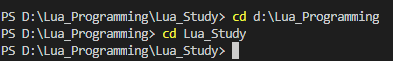
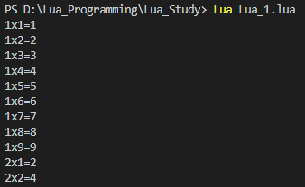
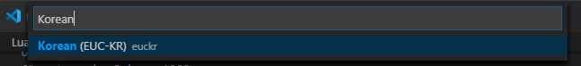
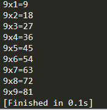

# 1.설치

+ 아래의 링크로 들어간 후 
download - binaries에서 최신파일을 다운받는다. 
<https://www.lua.org/download.html>

+ 그 후 압축을 풀고 lua53.exe 파일의 이름을 lua.exe로 변경한다. 
(편리하게 사용하기 위함)
   

# 2.실행
### 2-1. VS Code 사용하기
+ VS Code를 설치한 후 Extensions(Ctrl+Shift+X)에서 Lua를 설치한다.

+ File - Open Folder에서 작업할 폴더를 열고 Lua파일을 생성한다.

+ 코드를 작성한다.

+ Terminal - New Terminal(Ctrl+Shift+`)을 눌러 터미널을 열어준 후 cd 명령어를 통해 Lua파일이 있는 폴더로 이동한다.
 
    
+ Lua 파일명.lua 명령어를 통해 해당 파일을 실행한다.
 

+ 혹시나 한글이 깨진다면 오른쪽 하단의 UTF-8이라 표시된 Select Encoding 부분을 눌러 Korean(EUC-KR)로 변경한다.
 

### 2-2. Sublime Text 3 사용하기
+ 설치는 공식사이트에서 다운로드 하여 설치한다.
 <https://www.sublimetext.com>

+ 실행할 파일을 열고 Tools - Build(Ctrl+B)를 누른다.
 
   

# 3.정리
여러가지 방법이 있겠지만 처음에는 이 둘 중 한가지 방법으로 시작해보는건 어떨까?   
사용한지는 얼마되지 않았지만 개인적으로는 Sublime Text가 좀 더 편하다고 생각한다.